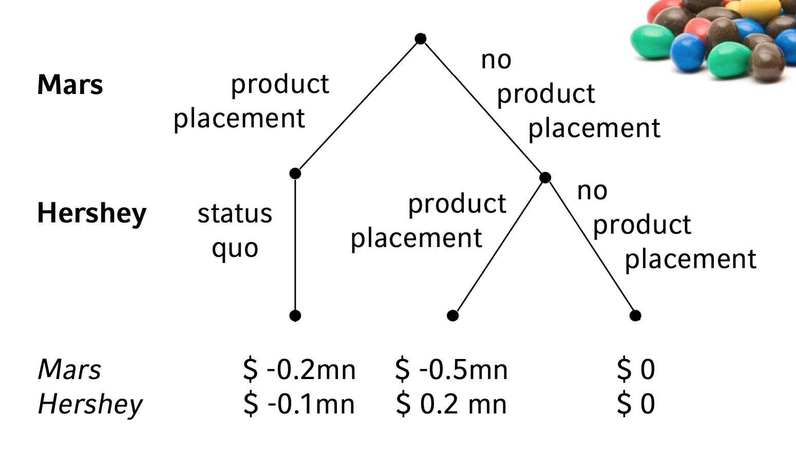

# Business Strategy Cheat Sheet

Business Strategy involves analysis of how businesses and organizations behave in situations in which strategic 
decisions are interdependent, i.e. where my actions affect my competitors' profits and vice versa. Using the basic 
tools of [game theory](https://github.com/cheat-sheets/game-theory-cheat-sheet), it analyses how businesses choose 
strategies to attain competitive advantage.

## Table of Contents

- [Basics](#Basics)
- [Resources](#resources)

## Basics

[Game Representations](https://github.com/cheat-sheets/game-theory-cheat-sheet#game-representations)

**Simultaneous Game** - is a game where each player chooses his action without knowledge of the actions chosen by other 
players.

**Sequential Game** - a game where one player chooses their action before the others choose theirs. 
Importantly, the later players must have some information of the first's choice, otherwise the difference in time 
would have no strategic effect.

**Dominant Strategy** - a strategy that is always better than any other strategy, 
regardless of what the other player is doing.

**Nash Equilibrium** - a set of strategies, one for each player, such that no player has incentive to change 
his strategy given what the other players are doing.

**Prisoner's Dilemma** - a standard example of a game analyzed in game theory that shows why two completely rational 
agents might not cooperate, even if it appears that it is in their best interests to do so. It's a simultaneous game.

### Toothpaste Wars

An example of a Prisoner's Dilemma is when Colgate and Sensodyne both advertise because it's a dominant strategy, 
share the market equally (the assumption here is that the size of the market stays the same regardless of whether
any company advertises):

|                          | **Advertise**           | **Don't advertise**          |
| ---                      | ---                     | ---                          |
| **Advertise**            | **$3M,$3M**             | $6M,$2M                      |
| **Don't advertise**      | $2M,$6M                 | $5M,$5M                      |

- Total market size: $10M
- Advertisement cost: $2M
- Market split when both advertise or no one advertises: 50%/50%
- Market split when one advertises and another doesn't: 80%/20%

### Chocolate Wars

- Universal Studio charges $1.0mn for a product placement in the movie 
[E.T. the Extra-Terrestrial](https://en.wikipedia.org/wiki/E.T._the_Extra-Terrestrial)
- Product placement by Mars
  - Mars' gross profits increase by $0.8M
  - Hershey's decrease by $0.1M
- Product placement by Hershey
  - Hershey's gross profits increase by $1.2M
  - Mars' decrease by $0.5M
- No product placement: "business as usual"

Mars decided to reject the deal and lost $0.5M. If the accepted the deal they would lose only $0.2M.

## Resources

- Competitive Strategy: course on Coursera https://www.coursera.org/learn/competitive-strategy
- Advanced Competitive Strategy: course on Coursera https://www.coursera.org/learn/advanced-competitive-strategy
